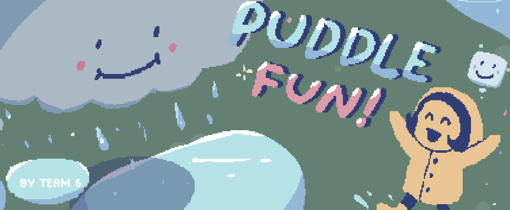

# 💦 Project Puddle

> Raining, playing with puddle, having fun. Make a splash. Spare the heads!  
> 下雨，玩水坑，找乐子。激起水花。别淋湿头！

*A Game Jam Practice Project | Game Jam 参赛作品*

- **Play the Game (itch.io):** [https://xxxstar.itch.io/puddle-fun](https://xxxstar.itch.io/puddle-fun)
- **Game Jam Page:** [https://itch.io/jam/dgas-2026-spring-game-jam/rate/4312022](https://itch.io/jam/dgas-2026-spring-game-jam/rate/4312022)
- **Development:** Developed by a 3-person team in 48 hours | 由三人小组在48小时内开发完成
- **Theme:** Puddle | 主题：水坑
- **Award:** Best implementation | 奖项：最佳实现 (Best implementation)

## 📖 OVERVIEW / 项目简介
**English:**  
We have successfully completed the first playable core DEMO.
- **Theme:** Puddle. The player controls a cloud to rain and create puddles, making children happy while avoiding raining directly on them.
- **Current Screens:** Menu, Game, Pause, and Game Over screens are implemented.

**中文：**  
我们已成功完成了第一个核心可玩 DEMO。
- **主题**：水坑。玩家控制一朵云降雨并制造水坑，让孩子们开心，同时要避免直接把雨淋在他们身上。
- **当前界面**：主菜单、游玩、暂停以及游戏结束界面均已实装。

---

## 🎮 CONTROLS / 操作指南
The game natively supports both keyboard and mainstream gamepad inputs. / 本作原生支持键盘与主流手柄输入：

| Action / 操作                 | Keyboard / 键盘          | Gamepad / 手柄                     |
| :---------------------------- | :----------------------- | :--------------------------------- |
| **Move / 移动**               | `W` `A` `S` `D` / Arrows | Left Stick / D-Pad                 |
| **Rain / 降雨**               | `Space` (空格)           | `A` Button                         |
| **Height Adjust / 高度升降**  | `J` / `K`                | `LB` / `RB`                        |
| **Pause & Menu / 暂停与取消** | `ESC`                    | `B` Button *(Menu 没反应；待修正)* |

---

## ✅ IMPLEMENTED CORE FEATURES / 已实现核心机制
**English:**
- **Cloud (Player):** Moves with inertia. Raining reduces its size, and it cannot rain if it gets too small. It can pick up randomly spawned power-ups to recover.
- **Power-ups:** Restore rain capacity and cloud size.
- **Puddles:** Formed when rain hits the ground. They naturally evaporate over time or disappear when an NPC steps on them.
- **NPCs:** Stepping on a puddle makes them happy and leave, which increases the total Emotion score. Getting rained on makes them unhappy, decreasing the Emotion score.
- **Emotion System:** Acts as the game's health bar. It naturally decays over time, and if it reaches zero, the game ends.
- **Scoring System:** Tracks survival time, the number of pleased NPCs, and the total number of NPCs.

**中文：**
- **云朵（玩家）**：带有惯性移动。降雨会消耗体积，体积过小时无法降雨。可以拾取随机生成的道具来恢复。
- **强化道具**：恢复降雨储备和云朵体积。
- **水坑**：雨水落到地面后形成。会随时间自然蒸发，或在 NPC 踩踏后消失。
- **NPC**：踩到水坑会让他们开心离开，从而增加总情绪分；被雨淋到会让他们不开心，从而扣除情绪分。
- **情绪系统**：相当于游戏的血条。随时间自然衰减，归零时游戏结束。
- **计分系统**：记录存活时间、满足的 NPC 数量以及生成的 NPC 总数。

---
## 👥 CREDITS / 制作人员名单

**Developed by Cornell DGA Spring 2026 Game Jam Team 6**  
**由 Cornell DGA Spring 2026 Game Jam 第 6 小组开发**

| Member / 成员                  | Roles / 职责                                                                           | Links / 链接                                                                                                                                                                                                                                  |
| :----------------------------- | :------------------------------------------------------------------------------------- | :-------------------------------------------------------------------------------------------------------------------------------------------------------------------------------------------------------------------------------------------- |
| **Team Member 1 (XXXStars0)**  | Manager, Lead Programmer, Designer, Music Composer 项目负责人、主程序员、策划、作曲 |      |
| **Team Member 2 (brcarry)**    | Programmer, Designer, QA / Testing 程序员、策划、质量保证与测试                     |   |
| **Team Member 3 (ethercloud)** | Concept Art, 2D Art, UI Design 原画设计、2D美术、UI设计                             |                                                                                                                      |
